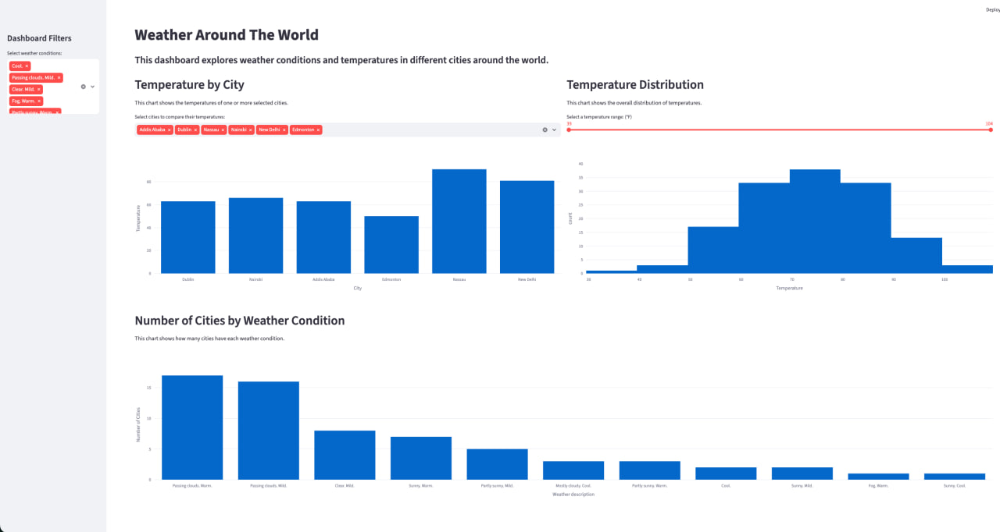

# weather-scraping-capstone
Weather Around The World Capstone Project

Weather scraping capstone project collects weather data from different cities, cleans that data using pandas, and stores it in SQLite database. It includes interactive Streamlit dashboard for exploring temperatures and weather conditions. 

Streamlit dashboard includes:
1. Temperature by city
2. Overall temperature distribution
3. Number of cities by weather condition

The deployed dashboard is available here:
https://weather-scraping-capstone.streamlit.app/

